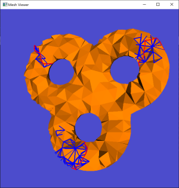
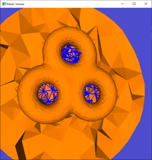

# Persistent-Homology-for-Handle-and-Tunnel-Loops
Finds the handle loops and tunnel loops given a mesh

## System

The code has been tested on Windows 10, Ubuntu 18.04 and MacOS 10.15.5.

## Directory Structure

>``` txt
>handle_tunnel_loop       -- Folder for computing handle & tunnel loops. 
>data                     -- Some models.
>CMakeLists.txt           -- CMake configuration file.
>resources                -- Some resources needed.
>3rdparty                 -- MeshLib and freeglut libraries.
>```

## Output
> 
